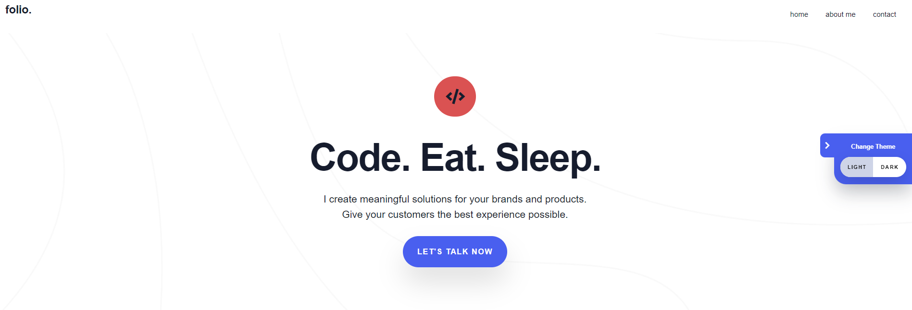
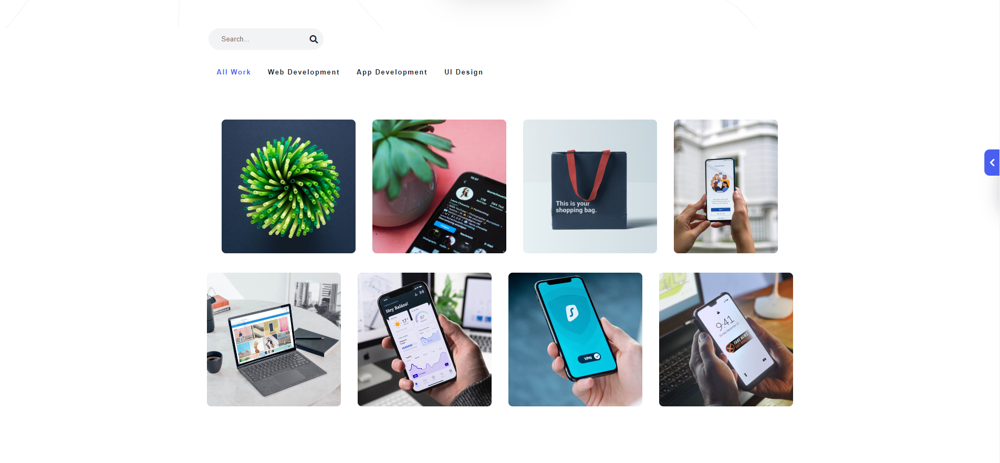
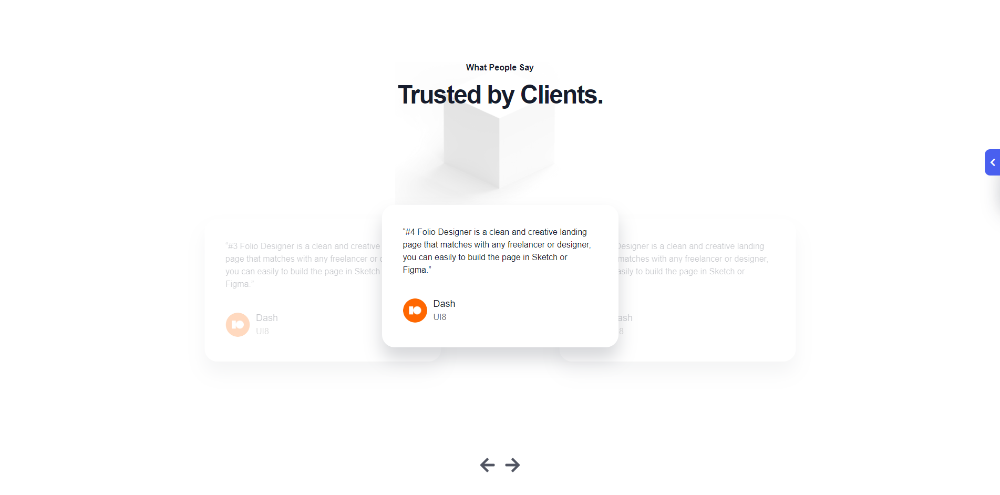
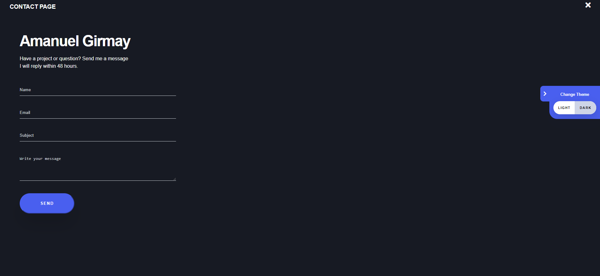
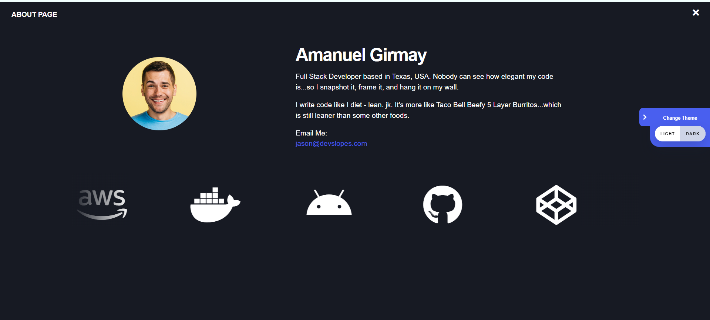

#Developer Portfolio

This project is a fully responsive portfolio website designed specifically for developers. It showcases modern web development techniques using only HTML, CSS, and JavaScript. The portfolio includes sections for showcasing skills, projects, and contact information, making it an ideal template for developers to present their work and expertise.

###Features

Fully Responsive Design: Works seamlessly across devices including mobile, tablet, and desktop.
Clean Layout: Minimalist and professional design tailored for developers.
Interactive Elements: Dynamic content and smooth scrolling effects using vanilla JavaScript.
Portfolio Showcase: Dedicated sections to showcase development projects and skills.
Contact Form: A functional form for potential clients or collaborators to get in touch.
Technologies Used
HTML5: Structuring the content and layout.
CSS3: Styling the portfolio with a focus on responsive design.
JavaScript (ES6+): Adding interactivity and dynamic elements.

You can directly open the index.html file by double-clicking it in your file explorer.

###screenshots

